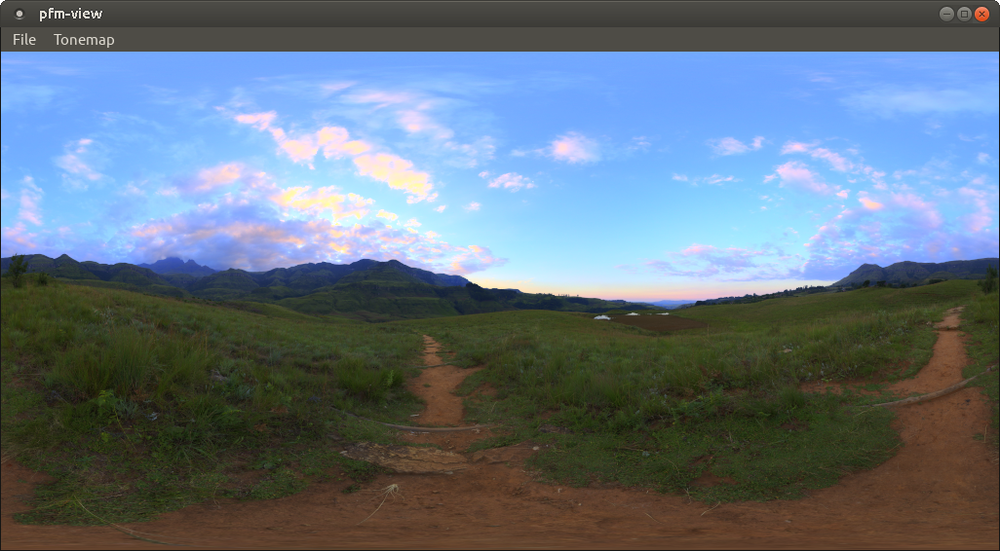

# pfm-view

A simple app for viewing high-dynamic-range PFM images. Written as a learner project in Python.

## Usage

The app has the following requirements:

- Python 3.5+
- PyQt5

To run the app, execute this in your terminal, in the repo's root:

`$ ./pfm_image.py`

Once the program is running, you can open a PFM image by selecting *File &rarr; Load PFM*. A sample PFM image is provided under [images/](images/).

(The process to load an image will take a few seconds, during which time the app is unresponsive. A future version will implement file loading in a non-GUI thread to prevent it from blocking the UI.)
